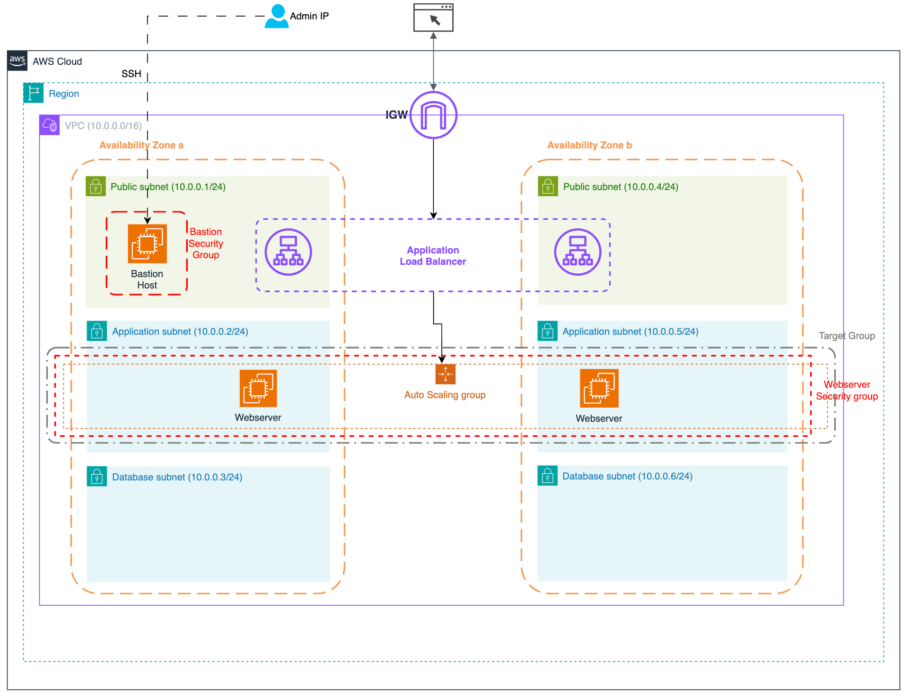

# Three Tier IaC using AWS CloudFormation

These templates will create the following resources:

-   1 VPC
-   1 Internet Gateway (IGW)
-   2 public subnets
-   2 private subnets for web server application
-   2 private subnets for database
-   1 bastion host for access and manage instances in private subnets
-   1 Application Load Balancer (ALB)
-   1 Auto Scaling Group (ASG)
-   1 Target Group
-   2 web server instances in private subnets
-   1 Security Group (SG) for the Bastion Host
-   1 Security Group (SG) for the web servers

The architectural diagram is as follows:

If you are interested in follow along the creation of this architecture, please check my blog post on Medium:
[Step by Step Three-tier application infrastructure using AWS CloudFormation - Part 1](https://azuax.medium.com/step-by-step-three-tier-application-infrastructure-using-aws-cloudformation-part-1-54b161aecf5d)
